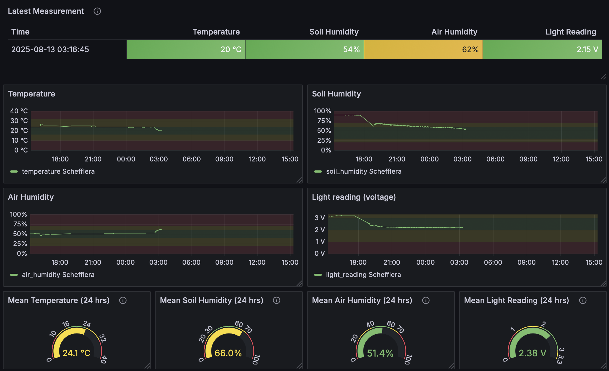

# The Schefflera Monitor - by Melker Rååd (mr224tp)

The Schefflera Monitor is an IoT device suited for monitoring environmental conditions, specifically for plants. It measures temperature, air humidity, soil humidity, and lighting conditions. 
The measurements are then compared to ideal and acceptable intervals, gathered from trusted sources (see targets.py). Based on the results, a LED which is either green (ideal), yellow (acceptable)
or red (poor) will light up on the device. As I live in a concrete building, the wifi connection can be somewhat unstable throughout the apartment. Therefore, the device must keep a stable upload flow to InfluxDB Cloud with retry/backoff so transient network issues won’t crash the system. A locally-hosted instance of Grafana then presents the data in a dashboard. A poor reading also makes Grafana Unified Alerting dispatch a summary email with the latest values for all sensors and personalized recommendations to improve conditions. The hardware is relatively quick to set up, but the software aspects takes some time. A rough approximation of the total implementation time
would be 5 hours. 

# Objective

The idea for this device came from my personal lack of gardening experience. This spring, my partner has been doing an internship in another city and hence, her plants were under my care. 
However, due to my not-so-green fingers, her beloved Schefflera has started looking worse and worse. I found it difficult to cater to its needs and did not understand what I was doing wrong.
Using the Schefflera Monitor, I can utilize the power of IoT to consistently evaluate the plant's living conditions and react immediately when its condition deteriorates. Therefore, the core
objective of this project is to provide a plant monitoring system that alerts the user when a plant needs attention. Additionally, gathering data over a long period of time could provide
a good data source for a more tailored care. For instance, one could analyze fluctuations in soil and air humidity between seasons to create appropriate watering schedules. I believe that
this project will provide deep insights into plant needs and serve as a tool for learning how to take proper care of plants.

# Material

//Explain all material that is needed. All sensors, where you bought them and their specifications. Please also provide pictures of what you have bought and what you are using.

| Component                     | Quantity | Specification                | Picture                          |
|-------------------------------|----------|-------------------------------|----------------------------------|
| Raspberry Pi Pico WH          | 1        | RP2040 with Wi-FI and bluetooth|     |
| Breadboard                    | 1        | 840 connections               |        |
| DHT11                         | 1        | Digital                       |        |
| CdS Photoresistor             | 1        | 4-7kΩ                         |           |
| LED (Red)     | 1        | 5mm, Diffuse                  |                 |
| LED (Yellow)     | 1        | 5mm, Diffuse                  |               |
| LEDs (Green)     | 1        | 5mm, Diffuse                  |                  |
| 330Ω Resistors                | update   | 0.25W                         | Self-explanatory                |
| 560Ω Resistors                | update   | 0.25W                         | Self-explanatory                |
| Jumper wire cables (M/M, M/F) | Various  | 30cm                          |               |
| Soil Hygrometer module        | 1        | Analog + Digital output       |             |
| Soil                          | 3 dl     | Same soil as in the Schefflera| Calibrate Soil Hygrometer module|

I bought almost all components at [[Electrokit](https://www.electrokit.com)], all components apart from the [[Soil Hygrometer module](https://www.electrokit.com/en/jordfuktighetssensor)] and some additional [[Jumper Wire cables](https://www.amazon.se/-/en/ELEGOO-Multi-Color-Compatible-Arduino-Project/dp/B01EV70C78/ref=nav_signin?crid=1CNW654HMSUTJ&dib=eyJ2IjoiMSJ9.qTh1eH3WaOJLu45veLDAh-tkjZzYN05VXFVpEXCXp16hFg5JuWqPiWjB10J4-3bMfS44tfF6HIrWAxFPzW1KpcJIWY7siJ_pu-msBOjhW6wa08EVC0QZkcUrQEE0nnKiX9L1VHWO_d12fqbKjeYijj1x5ET4l-U-elego3Kp_QpTWUtJ2XCKjiW3zvX43lrwVB4SHA_an1ur-EyVWP-kyVZ0_cY1o32xkr43EjEnFx0IhdJBBeUGuc3yRxoVBbDepdLYaHhoCTBVrNSUAYmOs0d5a3VXLaTLVfTDDhfy2QE.gTIavKrJeXsNked39s42T2UjbokwTfyEFaY-XSeXow0&dib_tag=se&keywords=kopplingskabel&qid=1751035957&refinements=p_98%3A20692919031&rnid=20692918031&rps=1&sprefix=kopplingskabel%2Caps%2C98&sr=8-1&th=1)], was included in [[Start Kit - Applied IoT at Linnaeus University (2025)](https://www.electrokit.com/lnu-starter)]. As I did not have any soil at home, I purchased it at my local supermarket for roughly 30 SEK. The cost for the soil is not included in the total cost as I imagine most users will have soil at home. The total cost for all components was approximately 500 SEK including shipping.

# Computer setup

When programming this device, I have been using the Visual Studio Code IDE. A crucial first step was to install the PyMAKR extension, available from the Visual Studio Code marketplace. While PyMakr [[is officially designed](https://github.com/pycom/Pymakr)] for Pycom devices, I found that it worked well for development with the Pico WH, likely since both expose a similar MicroPython USB serial interface. Using PyMAKR allowed me to upload code and interact with the device in PyMakr’s development mode. The main benefit from using the development mode is that the Pico WH is rebooted when files are changed. Hence, there was no need for manual rebooting. However since PyMakr is not officially supported for the Pico WH, some PyMAKRfeatures may be limited or unavailable. The primary script reads sensors on a one-minute interval and formats payloads in InfluxDB Line Protocol for transmission.

These were the main steps for setting up the Pico WH:
- The Pico WH was initially put into bootloader mode by holding the BOOTSEL button while connecting it to the via USB to a computer
- The latest MicroPython firmware for the Pico WH was then downloaded from the official [[Raspberry Pi documentation](https://www.raspberrypi.com/documentation/microcontrollers/micropython.html)] and copied to the device’s USB mass storage.
- After flashing the device, it appears as a serial device over USB.
- Install [[Node.js](https://nodejs.org/en/download)]
- At this point, WiFi and InfluxDB credentials should also be added to keys.py which should also be added to gitignore. I have not done this, for demonstrative purposes, but it should be done.
- Code is uploaded to the device and tested via PyMakr in development mode.

# Electronics

The electrical wiring of my setup is shown in the following diagram, created through fritzing.

 

To properly connect the components you should go through the following steps.

Soil Humidity Sensor:
- Connect the two parts of the sensor using jumper wires.
- Connect the VCC pin of the sensor to the VBUS pin 40 on the pico.
- Connect the GND pin of the sensor to GND.
- Connect the AO pin of the sensor to a 330 ohm resistor. Connect a jumper wire from the other end of the resistor to ADC pin 26 on the pico. To not damage the pin with 5V, you then need to add two serial 10k ohm and 4.7k ohm reistors between the jumper wire and GND. 

Photoresistor (CdS):
- Connect one leg of the photoresistor to 3.3V.
- Connect the other leg of the photoresistor to pin GP21 on the pico using a jumper wire. 
- On the other side of the jumper wire, place a 10k ohm reistor followed by a jumper wire to GND.

DHT11:
- Connect a 10k ohm resistor between the VCC and GND pins of the sensor.
- Connect the VCC pin to a 3.3V pin on the pico.
- Connect the GND pin to a GND pin on the pico.
- Connect the signal pin on the sensor to pin GP13 on the pico.

Red LED: 
- Connect one of the LED's legs to GND.
- Connect a 330 ohm resistor to the LED's other leg.
- On the other side of the resistor, connect a jumper wire to pin GP15 on the pico.

Yellow LED: 
- Connect one of the LED's legs to GND.
- Connect a 330 ohm resistor to the LED's other leg.
- On the other side of the resistor, connect a jumper wire to pin GP14 on the pico.

Green LED: 
- Connect one of the LED's legs to GND.
- Connect a 330 ohm resistor to the LED's other leg.
- On the other side of the resistor, connect a jumper wire to pin GP14 on the pico.

During the project, some electrical calculations were essential. As you can see in the wiring instructions for the soil humidity sensor, I created a voltage divider to prevent over-voltage to the pico's ADC. This is since the sensor is powered by 5V but the pico's ADC can only handle a max voltage of 3.3V.

With my voltage divider, the $V_ADC$ can be calculated as $V_ADC= V_SENSOR*R_2/(R_1+R_2)=5*4.7/10+4.7=1.598...$ which is safe for the pico's ADC.


//How is all the electronics connected? Describe all the wiring, good if you can show a circuit diagram. Be specific on how to connect everything, and what to think of in terms of resistors, current and voltage. Is this only for a development setup or could it be used in production?

//Circuit diagram (can be hand drawn)
//*Electrical calculations


# Platform

Platform-wise, my final setup uses InfluxDB Cloud combined with a locally hosted instance of Grafana. Initially, I experimented with a self‑hosted InfluxDB instance on a macOS server. The server responded correctly on localhost but unfortunately returned "Empty reply from server" or ECONNRESET when queried from LAN IP. After very extensive troubleshooting (using curl, tcpdump, firewall checks and reading influxd logs), I decided to migrate to InfluxDB Cloud. The migration eliminated many of these issues, and it was very easy to use as a data source in Grafana. 

InfluxDB Cloud offers [[multiple subscription types](https://www.influxdata.com/influxdb-pricing/?_gl=1*15yxm1o*_gcl_au*MTAzOTcxMzUwNy4xNzUxNjU3MTMz*_ga*MTE2MTYyMDY0OS4xNzUxNjU3MTMz*_ga_CNWQ54SDD8*czE3NTE4NDY4NTEkbzUkZzEkdDE3NTE4NDY4NjkkajQyJGwwJGg0OTExMzExMA..)], and I decided to go for the free version. This version includes 30 days data storage, alerts (only on Slack) and up to 1,000 kb/s reads and 17 kb/s writes for up to 10,000 series. If you remember, this project enables alerts by email as well. However, the alerts are setup from the Grafana instance and not the InfluxDB cloud, hence being limited to Slack by InfluxDB does not affect the project. If this project's scope was extended, one would likely want to investigate the other subscription options. The main benefit of upgrading to a paid plan would be a data retention exceeding 30 days. Additionally, as all alert handlers (including email) are available for paid subscriptions, the alert responsibility could be moved from Grafana to InfluxDB. Hence, the project could be made less dependent on Grafana and only use it for visualization purposes. 


# The code

To clearly describe the logic of the code, the best decision is to look at my main.py function. This is the core of the application.

```python
import time
import dht11 as dht_sensor
import CdS
import update_light
import soil_sensor
import write_DB as db

import os
print(os.uname())   #Useful for inspecting current OS and understanding logs

import wifiConnection
wifiConnection.connect()    #Handles wifi connection, very similar to example provided from the course

while True:
    temp, humidity = dht_sensor.read_dht()  #each sensor's logic is handled in its own file
    if temp is not None:
        print("Temperature:", temp, "°C")   #not ideal, but useful for seeing values directly in terminal. 
        print("Humidity:", humidity, "%")
    light_reading, light_voltage = CdS.measure_light()
    if light_reading is not None:
        print(f"Light sensor reading: {light_reading}, Voltage: {light_voltage:.2f} V")
    soil_humidity = soil_sensor.read_soil_humidity()
    if soil_humidity is not None:
        print("Soil Humidity: ", soil_humidity , "%")
    update_light.light_update(temp,humidity,light_voltage,soil_humidity) #Handles light logic (and thresholds)

    fields = {
        "temperature": temp,
        "air_humidity": humidity,
        "light_reading": light_voltage,
        "soil_humidity": soil_humidity
    }

    db.send_to_influx("sensor_data", fields, tags="plant=Schefflera") #transmits the data
    time.sleep(60)
```
Inside the loop, the values from each sensor is read. Then, the LED lights on the breadboard are updated based on the values. Finally, the data is transmitted to InfluxDB Cloud. An interesting part of this application is actually the target values. Located in target.py, the target values are displayed in this format:
```python

ideal_temperature=(16,24)
acceptable_temperature=(10,32) 

```
This separation of target values makes the application very versatile, as the values in target.py could be changed to match the requirements of other plants and therefore makes the application useful for all plants. 

Using the thresholds (derived from other sources, references are in target.py), I quickly deduced that my light sensor and soil humidity sensor was not working as expected. When the plant had not been watered for 7 days, the soil humidity sensor reported a humidity of 57% in the soil. Therefore, I had to calibrate the values. For the soil humidity sensor, my approach was to test the sensor on totally dry soil and completely water-saturated soil. After some research, I came up with the following method:

- Use (or buy) the same soil you used when planting the Schefflera.
- Spread it out on a tray, or oven dish, with a depth of 2-3 centimetres.
- It needs to be relatively fine-grained, grind if needed.
- Bake in oven at 105 Celsius for 2 hours (stir once every 30 minutes)

You should now have very dry soil and it should look like this:


- Let it cool for approx. 10 minutes.
- Stir the soil again and pour it into a coffee mug or bowl.
- Place the soil humidity sensor in the mug (or bowl) and wait for 5-10 minutes.
- Write down the soil humidity value, this is the "dry value", and pull out the sensor. 
- Pour water slowly into the mug, small puddles are ok but no standing water.
- Let it soak for 10 minutes.
- Place the soil humidity sensor in the mug again and wait for 5-10 minutes.
- Write down the soil humidity value, this is the "wet value", and pull out the sensor. 
- Add the values to the calibrations.py file.

For me, the values I obtained were: 
```python
soil_sensor_dry=15
soil_sensor_wet=60
```
I then rewrote the logic in the soil_sensor.py file to use my soil_sensor_dry value as 0% soil humidity and my soil_sensor_wet value as 100% soil humidity. To ensure reasonable values, I also ensured that no values lower than 0% or higher than 100% would be returned. See the updated logic below:

```python
def read_soil_humidity():
    value = input.read_u16()  # 0 to 65535
    raw_percent = (65535 - value) / 65535 * 100  # Convert to 0-100% (wet=high, dry=low)
    
    dry = calibrations.soil_sensor_dry
    wet = calibrations.soil_sensor_wet
    
    if wet == dry:
        return 0  # no division by zero
    
    moisture_percent_calibrated = (raw_percent - dry) * 100 / (wet - dry)
    moisture_percent_calibrated = max(0, min(100, int(moisture_percent_calibrated)))
    return moisture_percent_calibrated
```
With these modifications, the soil humidity sensor worked as expected. As previously mentioned, I also calibrated the light sensor. To not bloat this readme, I will describe that process in a very short manner. I noted the light sensor value in direct sunlight and then noted the value when in "complete" darkness (I put the sensor inside a room without windows and closed the door). I then added the values to calibrations.py and updated the logic in CdS.py. 

Import core functions of your code here, and don't forget to explain what you have done! Do not put too much code here, focus on the core functionalities. Have you done a specific function that does a calculation, or are you using clever function for sending data on two networks? Or, are you checking if the value is reasonable etc. Explain what you have done, including the setup of the network, wireless, libraries and all that is needed to understand.

# Transmitting the data / connectivity

Every minute the Pico WH sends a payload such as:
```python
sensor_data temperature=23,air_humidity=45,light_reading=12000,soil_humidity=36
```
These 60 s cycles give near-real-time visibility without overloading the network. I chose Wi-Fi (2.4 GHz) because it was already available at home and added no extra hardware cost. If you were monitoring outdoor plants or locations without Wi-Fi, I would recommend LTE for reliable coverage and higher throughput. While LoRa could greatly reduce power consumption, my device runs off USB power, so battery life wasn’t a constraint. Finally, I send data over HTTPS (port 443) using InfluxDB’s line protocol payload to ensure encryption, firewall-friendliness, and compatibility with cloud APIs.

# Presenting the data





Describe the presentation part. How is the dashboard built? How long is the data preserved in the database?

Provide visual examples on how the dashboard looks. Pictures needed.
How often is data saved in the database.
*Explain your choice of database.
*Automation/triggers of the data.


# Finalizing the design

Show the final results of your project. Give your final thoughts on how you think the project went. What could have been done in an other way, or even better? Pictures are nice!

Show final results of the project
Pictures
*Video presentation
